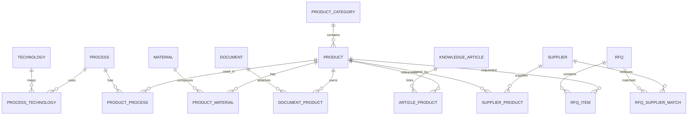

# ERD 요약

```mermaid
erDiagram
  PROCESS ||--o{ PRODUCT_PROCESS : has
  PRODUCT ||--o{ PRODUCT_PROCESS : used_in
  TECHNOLOGY ||--o{ PROCESS_TECHNOLOGY : maps
  PROCESS ||--o{ PROCESS_TECHNOLOGY : uses
  MATERIAL ||--o{ PRODUCT_MATERIAL : composes
  PRODUCT ||--o{ PRODUCT_MATERIAL : has
  PRODUCT_CATEGORY ||--o{ PRODUCT : contains
  PRODUCT ||--o{ SUPPLIER_PRODUCT : offered_by
  SUPPLIER ||--o{ SUPPLIER_PRODUCT : supplies
  KNOWLEDGE_ARTICLE ||--o{ ARTICLE_PRODUCT : links
  PRODUCT ||--o{ ARTICLE_PRODUCT : referenced
  DOCUMENT ||--o{ DOCUMENT_PRODUCT : attaches
  PRODUCT ||--o{ DOCUMENT_PRODUCT : owns
  RFQ ||--o{ RFQ_ITEM : contains
  PRODUCT ||--o{ RFQ_ITEM : requested
  RFQ ||--o{ RFQ_SUPPLIER_MATCH : matched
  SUPPLIER ||--o{ RFQ_SUPPLIER_MATCH : receives
```
